# Ejercicio 1
##  Prerrequisitos
Antes de realizar la tarea habrá preparar la máquina virtual de Debian 13 para lo cual habrá que usar un ```sudo apt update``` y un ```sudo apt upgrade``` para actualizar los repositorios y así poder posteriormente realizar un ```sudo apt-get install ruby-full build-essential zlib1g-dev``` para instalar las gemas.  

Además, habrá que realizar los siguientes comandos para agregar las variables de entorno a los archivos *~/.bashrc* para configurar la ruta de instalación de las gemas:
- ```echo '# Install Ruby Gems to ~/gems' >> ~/.bashrc```
- ```echo 'export GEM_HOME="$HOME/gems"' >> ~/.bashrc```
- ```echo 'export PATH="$HOME/gems/bin:$PATH"' >> ~/.bashrc```
- ```source ~/.bashrc```

Por ultimo habrá que usar el comando ```gem install bundler Jekyll``` para instalar bundler y jekyll.  

## Creación del sitio de Jekyll
### Paso 1: Crear el repositorio en GitHub
El primer paso será crear un nuevo repositorio en GitHub para lo cual en la cuenta de GitHub habrá que clicar en el botón verde **New** y en la pestaña que salga en *Repository name*  habrá que poner el nombre deseado que en este caso será **myblog3**, en *Description* habrá que poner una descripción para el repositorio que en este caso será **Blog para hacer la actividad 2.1** y en *Configuration* habrá que dejar todos los parámetros por defecto obteniendo que *Choose visibility* sea **Public** para que la web sea pública, *Add README* sea **Off** para que no genere un README, *Add .gitignore* sea **No .gitignore**  y *Add license* sea **No license** para que no tenga licencia. Tras rellenar la información habrá que clicar en **Create repository**.  

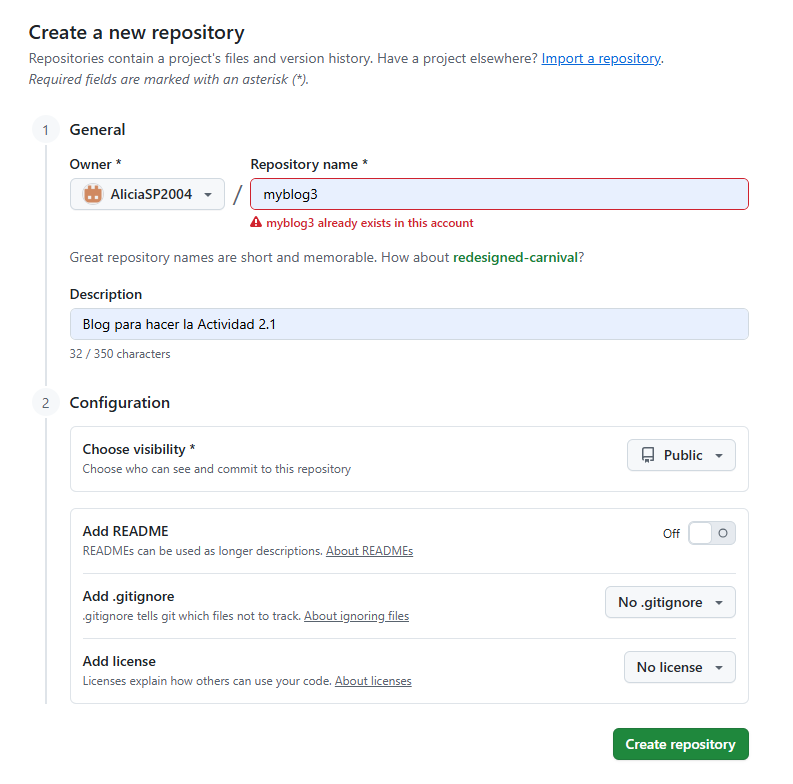
### Paso 2: Crear el repositorio local
El segundo paso para realizar la tarea será crear el repositorio en local para lo cual en la carpeta repositorios he creado una nueva carpeta llamada myblog3 con el comando ```mkdir myblog3```, después he entrado a myblog3 utilizando el comando ```cd myblog3``` y a continuación he utilizado el comando ```git init``` para inicializar el repositorio.    

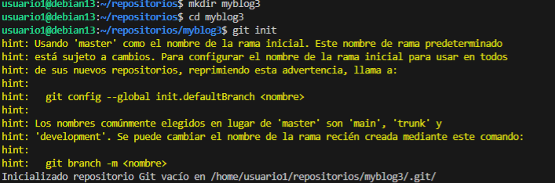  

A continuación he conectado el repositorio local con el remoto creado anteriormente con el comando ```git remote add origin https://AliciaSP2004:gh.......``` donde el enlace es el del repositorio de GitHub añadiéndole después de // el nombre del usuario : mi token @. Tras el paso anterior y antes de proseguir he creado una nueva rama llamada gh-pages y me he cambiado a ella con el comando ```git checkout -b gh-pages```.  

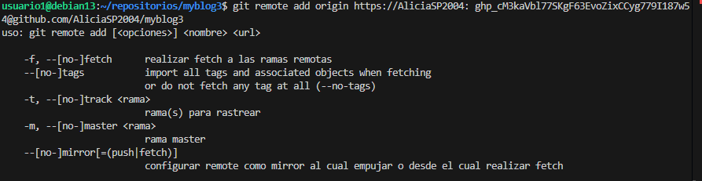 
 
### Paso 3: Crear el sitio en Jekyll
El tercer paso es crear el sitio en Jekyll para lo cual ha utilizado el comando ```jekyll new .```, en este caso no hará falta realizar ningún paso extra para utilizar el tema mínima puesto que es el tema que utiliza por defecto Jekyll.    

     

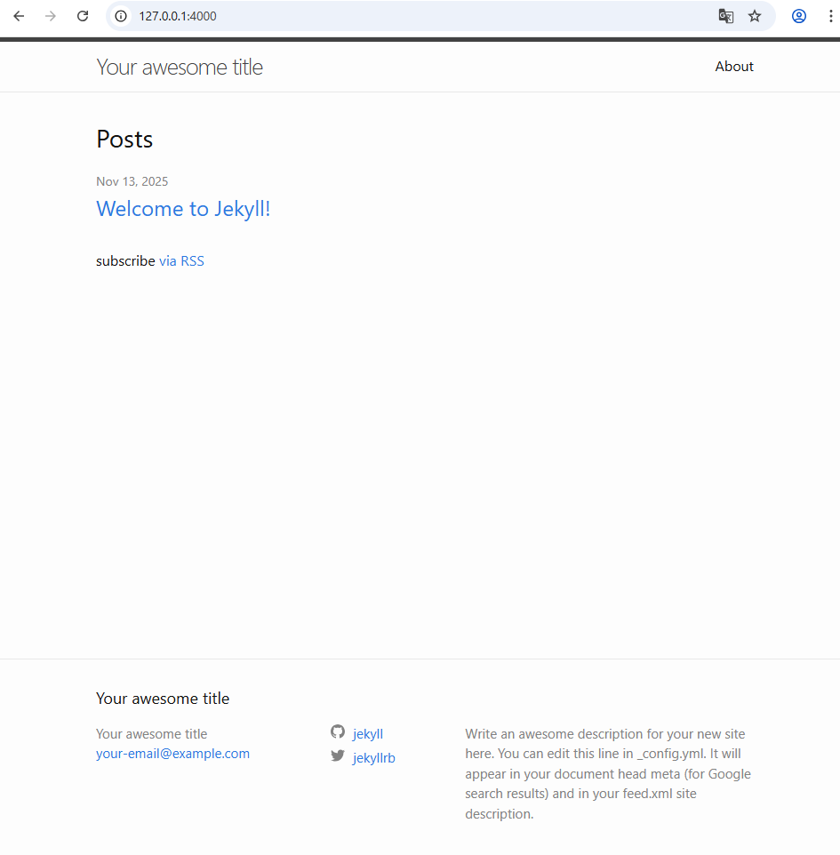 
### Paso 4: Modificar los archivos
Para que la página web cumpla con las especificaciones pedidos por la tarea y que tenga las características deseadas hay que modificar y crear una serie de archivos necesarios para el correcto funcionamiento y la estética deseada de la página web.   

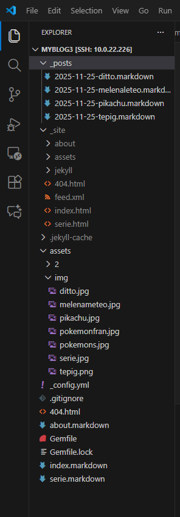   

Durante la modificación de los archivos he comprobado en varias ocasiones que todos esté creando correctamente para lo cual he utilizado el comando ```bundle exec jekyll build```.  

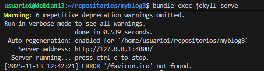 
- #### _config.yml
El primer archivo que he modificado es el *_config.yml* donde he modificado *title* para ponerle a la página un título acorde al tema del que va a tratar que en este caso será Pokemon, *email* para poner mi email, *description* para poner una breve descripción que se encontrará en el pie de página de la web, *baseurl* para poner la subcarpeta en la que se encuentra el sitio, *url* para poner la url principal del sitio y *twitter_username* y *github_userame* para poner mi usuario de Twitter y de GitHub respectivamente.   

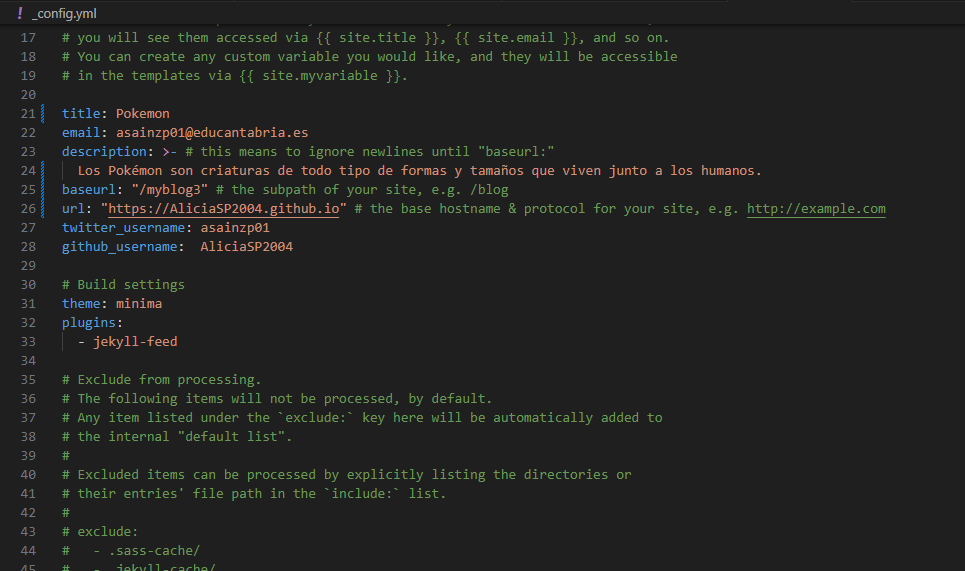 
- #### index.markdown
También he modificado el archivo *index.markdown* donde he puesto lo que va a haber en la página principal. Las modificaciones que he hecho ha sido añadir el *title* para ponerle un título a la página principal que en este caso será Pokemon, añadir una descripción de lo que es la empresa Pokémon y añadir una imagen del logo de Pokemon.  

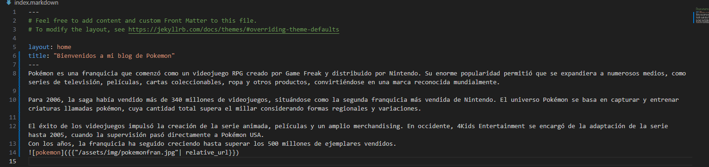 
- #### about.markdown
Otro archivo que ha modificado es el *about.markdown* al que le he cambiado el *title* para que corresponda con el tema de la página siendo este ¿Qué es un Pokémon?, también le he puesto una breve descripción de lo que es un Pokémon y le he añadido una imagen con algunos Pokémon.  
 
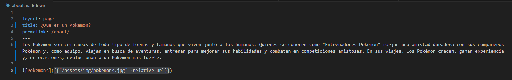 
- #### serie.markdown
Además de modificar los archivos ya creados he creado uno nuevo utilizando el *about.markdown* como plantilla al que he llamado *serie.markdown* y al que he modificado el *title* poniéndole un título acorde al contenido que va a tener que en este caso será Serie de televisión, le he cambiado el *permalink* para que no sea igual que el del about y que no se pueda intercambiar las páginas y le he añadido una descripción de la serie de Pokémon y una imagen de esta.  

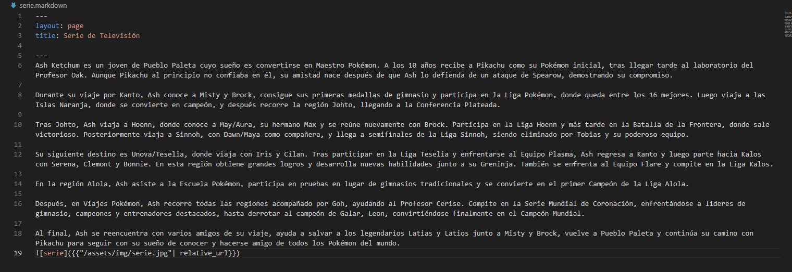 
- #### _posts
Para los post he ido a la carpeta *_posts* y he cogido el que había predeterminado como plantilla para realizar otros 3 posts. Los nombres que les he puesto los post para identificarlos más fácilmente siguen la siguiente estructura fecha_creacion-nombre_pokemon.markdown.     

Las modificaciones qué he hecho en los archivos de los post han sido cambiarle el *title* para que corresponda con el nombre del Pokémon del que va a hablar el post, cambiarle el *date* para ponerle la fecha actualizada de cuándo se ha creado el post, añadirle una breve descripción del Pokemon y añadirle una imagen donde se vea cómo es el Pokemon.  

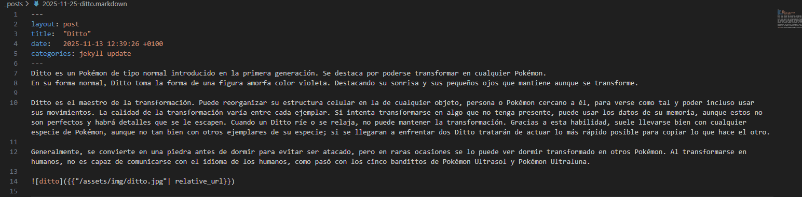   

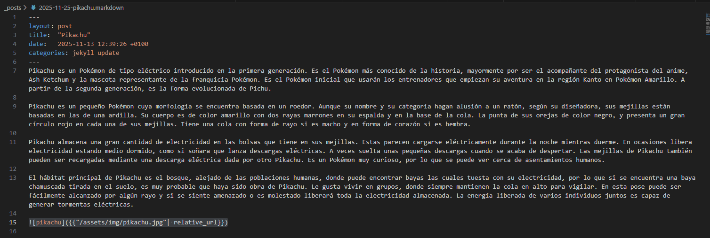   

   

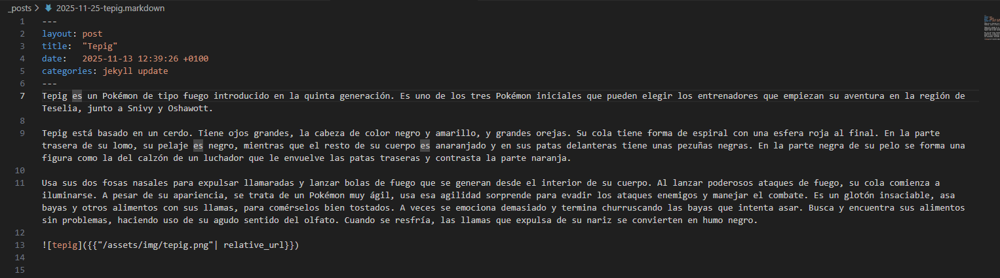 
- #### Imágenes
Para añadir las imágenes a los archivos Markdown y que no haya errores he creado la carpeta *assets* y dentro de esta he creado la carpeta *img* dónde he metido todas las imágenes que utilizado para realizar la página web.    

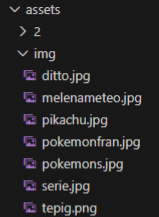
### Paso 5: Guardar y subir el trabajo
Para conseguir que las modificaciones que he hecho el local se representen en el sitio web he utilizado el comando ```git add .``` para preparar los cambios, el comando ```git commit -m “Cambios realizados”``` para guardar los cambios y el comando ```git push origin gh-pages``` para subir los cambios al repositorio de GitHub.
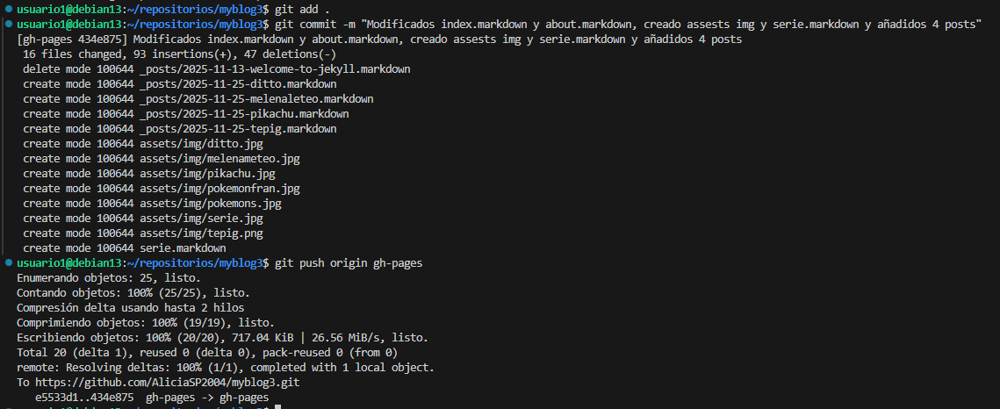
### Paso 6: Publicar el sitio 
Para publicar el sitio en GitHub he entrado en el repositorio *myblog3*, he ido a *settings* y desde allí he ido a *Pages* donde he visto que la generación de dominio ha sido automática por lo que he ido al enlace de la página que se encuentra en la parte superior y he entrado en el para comprobar que la página funciona correctamente.  

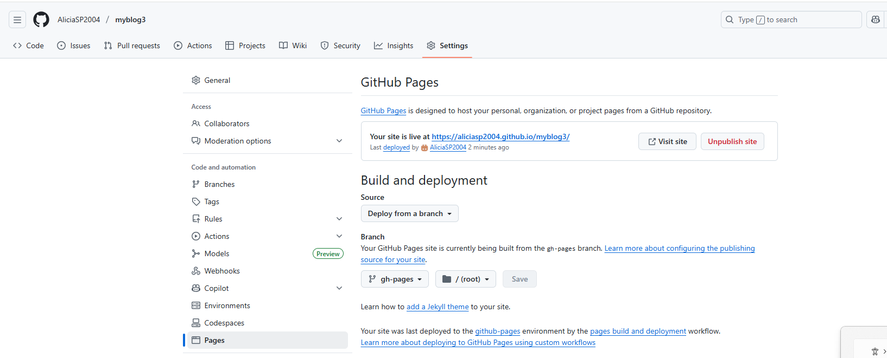  

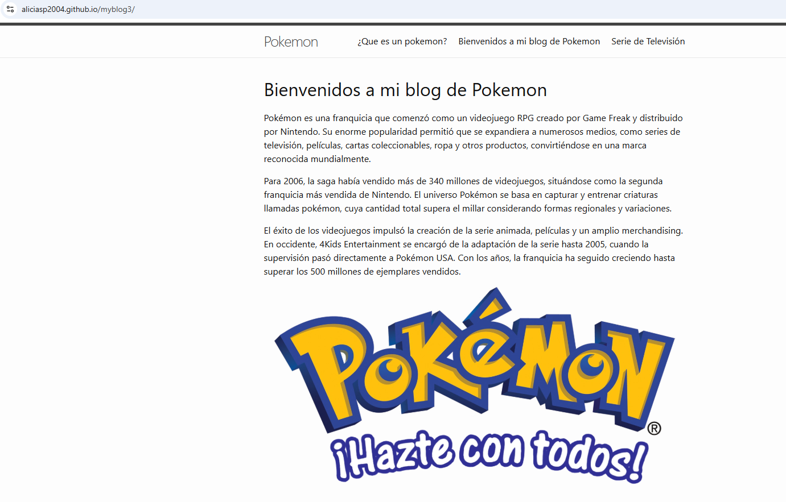  
