# Ejercicio 2
##  Prerrequisitos
Antes de realizar la tarea habrá preparar la máquina virtual de Debian 13 para lo cual habrá que usar un ```sudo apt update``` y un ```sudo apt upgrade``` para actualizar los repositorios y así poder posteriormente realizar un ```sudo apt-get install ruby-full build-essential zlib1g-dev``` para instalar las gemas.  

Además, habrá que realizar los siguientes comandos para agregar las variables de entorno a los archivos *~/.bashrc* para configurar la ruta de instalación de las gemas:
- ```echo '# Install Ruby Gems to ~/gems' >> ~/.bashrc```
- ```echo 'export GEM_HOME="$HOME/gems"' >> ~/.bashrc```
- ```echo 'export PATH="$HOME/gems/bin:$PATH"' >> ~/.bashrc```
- ```source ~/.bashrc```

Por ultimo habrá que usar el comando ```gem install bundler Jekyll``` para instalar bundler y jekyll.  
## Ejecución
### Paso 1: Crear el repositorio en GitHub
El primer paso será ur a la página web de *jekyll themes* y buscar el tema *Lagrange*, después habrá que seleccionarle tras lo cual habrá que clicar en *download* para habrir el repositorio en GitHub del creador de *Lagrange*.     

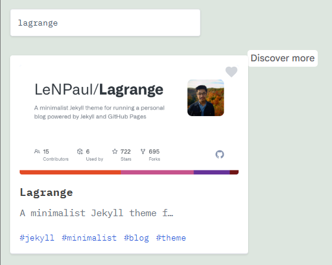    

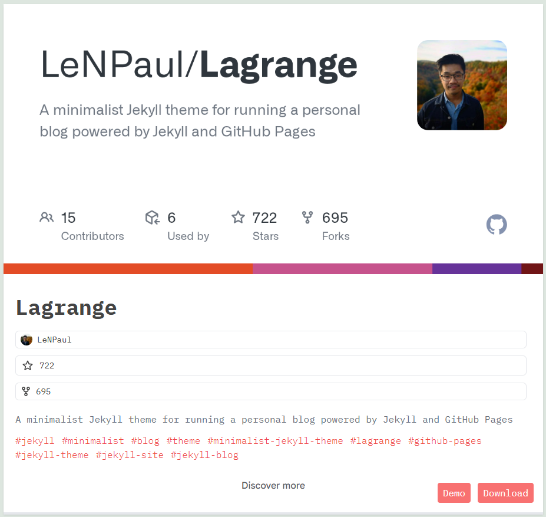     


A continuación habrá que hacer un fork al repositorio de *Lagrange* para lo cual habrá que seleccionar la opción *fork* que se encuentra en la zona superior derecha y darle a *New fork* tras lo cual saldrá una pestaña con una serie de campos los cuales son *Repository name* donde pondré el nombre que deseo ponerle al repositorio, *Description* donde pondré una breve descripción del repositorio y además seleccionaré la opción *Copy the gh-pages branch only* para que solo copie la información que se encuentra en la rama gh-pages. Por último, habrá que clicar en *Create frork* para terminar el fork.    

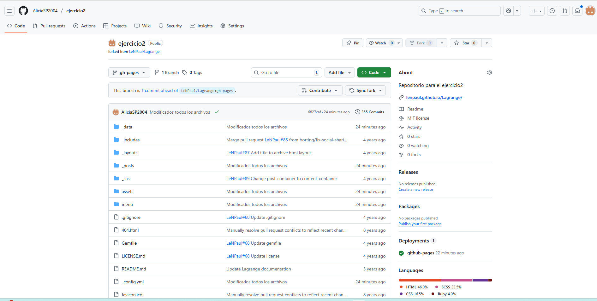  

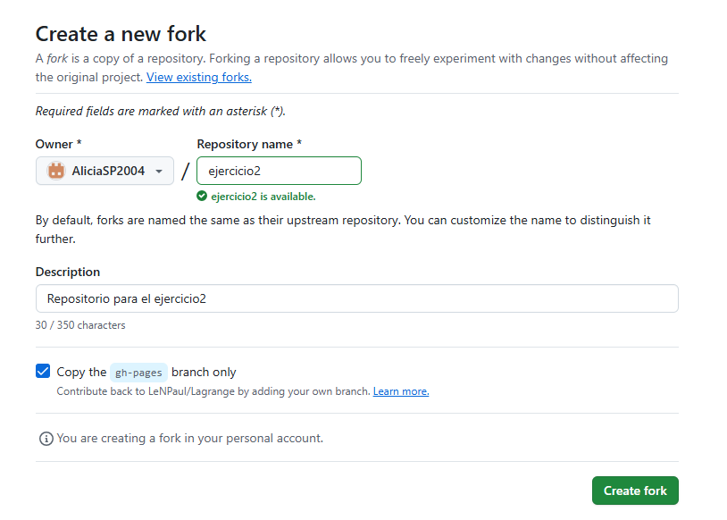  
### Paso 2: Crear el repositorio local
El segundo paso será crear el repositorio local para lo cual en la carpeta repositorios habrá que usar el con el comando ```git clone https://AliciaSP2004:gh.......``` donde el enlace es el del repositorio de GitHub añadiéndole después de // el nombre del usuario : mi token @.    

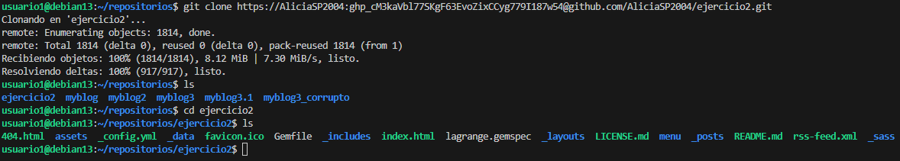  
### Paso 3: Modificar los archivos
Para que la página web cumpla con las especificaciones pedidos por la tarea y que tenga las características deseadas hay que modificar y crear una serie de archivos necesarios para el correcto funcionamiento y la estética deseada de la página web.   

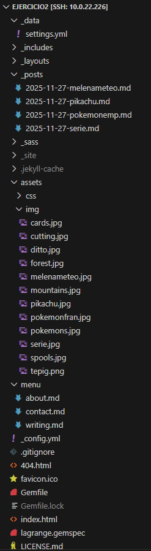   

Durante la modificación de los archivos he comprobado en varias ocasiones que todos esté creando correctamente para lo cual he utilizado el comando ```bundle exec jekyll build```.  
- #### _config.yml
El primer archivo que he modificado es el *_config.yml* donde he modificado *title* para ponerle a la página un título acorde al tema del que va a tratar que en este caso será Pokemon, *author* en el que he puesto mi nombre para indicar que he personalizado yo la pagina y *description* para poner una breve descripción.

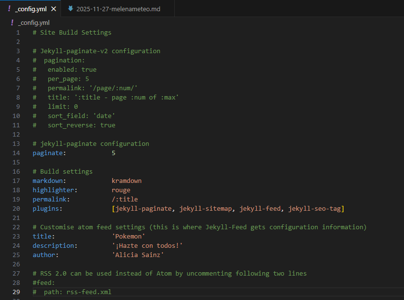 
- #### contact.md
También he modificado el archivo *contact.md* donde he puesto un breve texto que indica como contactar con el creador de la pagina que en este caso soy yo.

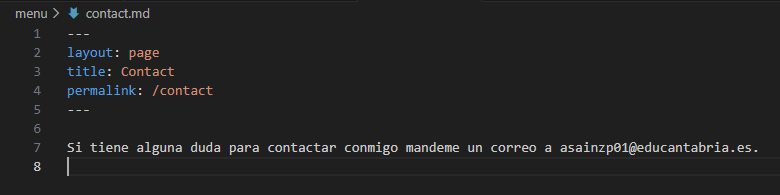 
- #### about.md
Otro archivo que ha modificado es el *about.md* al que le he cambiado el *title* para que corresponda con el tema de la página siendo este ¿Qué es un Pokémon?, también le he puesto una breve descripción de lo que es un Pokémon y le he añadido una imagen con algunos Pokémon.  
 
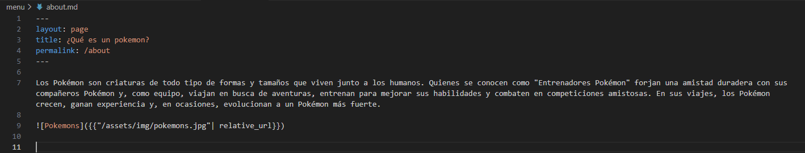 

- #### _posts
Para los post he ido a la carpeta *_posts* y he cogido el que había predeterminado como plantilla para realizar otros 4 posts. Los nombres que les he puesto los post para identificarlos más fácilmente siguen la siguiente estructura fecha_creacion-nombre_post.md.     

Las modificaciones qué he hecho en los archivos de los post han sido cambiarle el *title* para que corresponda con el tema del que va a hablar el post, cambiarle el *image* para ponerle una imagen mas acorde con el tema que va ha tratar y añadirle una breve descripción relacionada con el tema.  

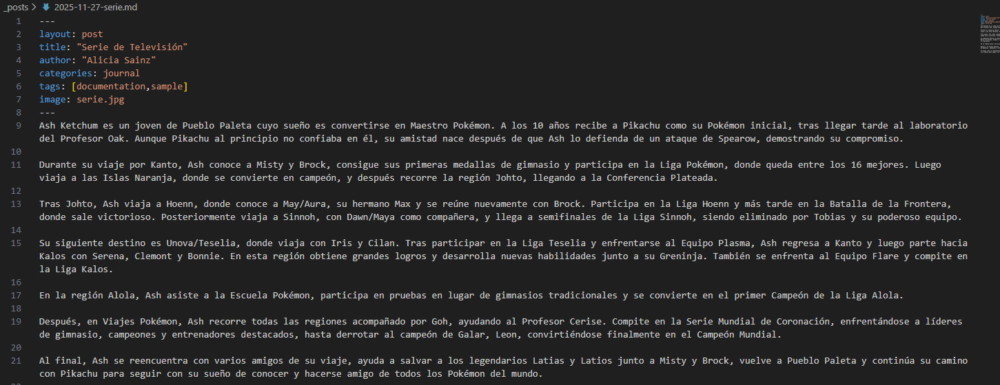   

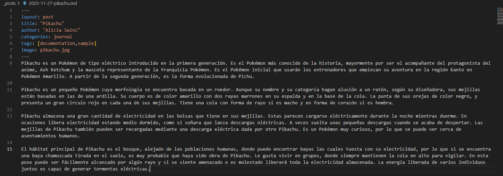   

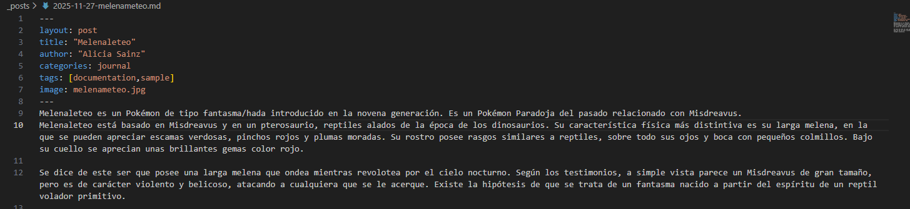   

 

- #### settings.yml
Otro documento que he modificado ha sido el settings.yml que se encuentra dentro de _data para cambiar las redes sociales por defecto por mis redes sociales para lo cual he ido al apartado social: y eliminado las redes sociales que no me interesa poner ya modificado la línea de GitHub para poner en link a mi GitHub.

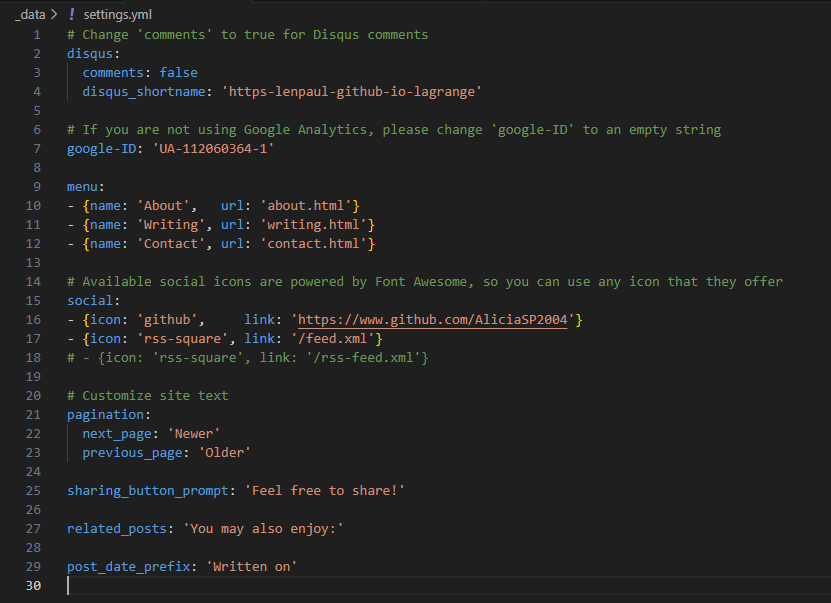
- #### Imágenes
Para añadir las imágenes a los archivos Markdown y que no haya errores he añadidos las imagenes a la carpeta *img* que se encuentra dentro de la carpeta *accets*.


### Paso 4: Guardar y subir el trabajo
Para conseguir que las modificaciones que he hecho el local se representen en el sitio web he utilizado el comando ```git add .``` para preparar los cambios, el comando ```git commit -m “Cambios realizados”``` para guardar los cambios y el comando ```git push origin gh-pages``` para subir los cambios al repositorio de GitHub.  


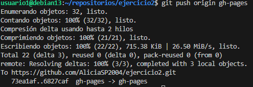
### Paso 5: Publicar el sitio 
Para publicar el sitio en GitHub he entrado en el repositorio *ejercicio2*, he ido a *settings* y desde allí he ido a *Pages* donde he visto que la generación de dominio ha sido automática por lo que he ido al enlace de la página que se encuentra en la parte superior y he entrado en el para comprobar que la página funciona correctamente.  

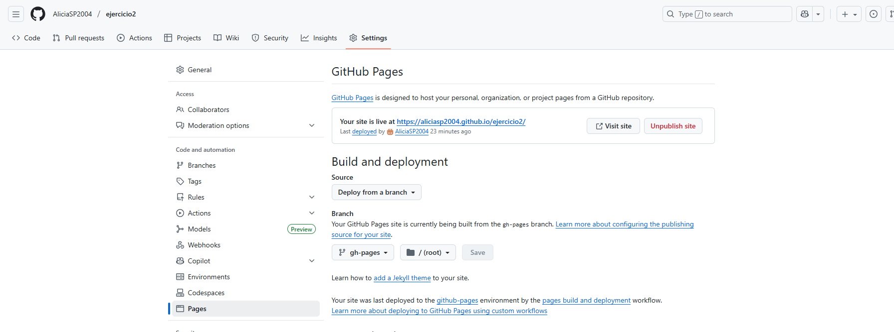  

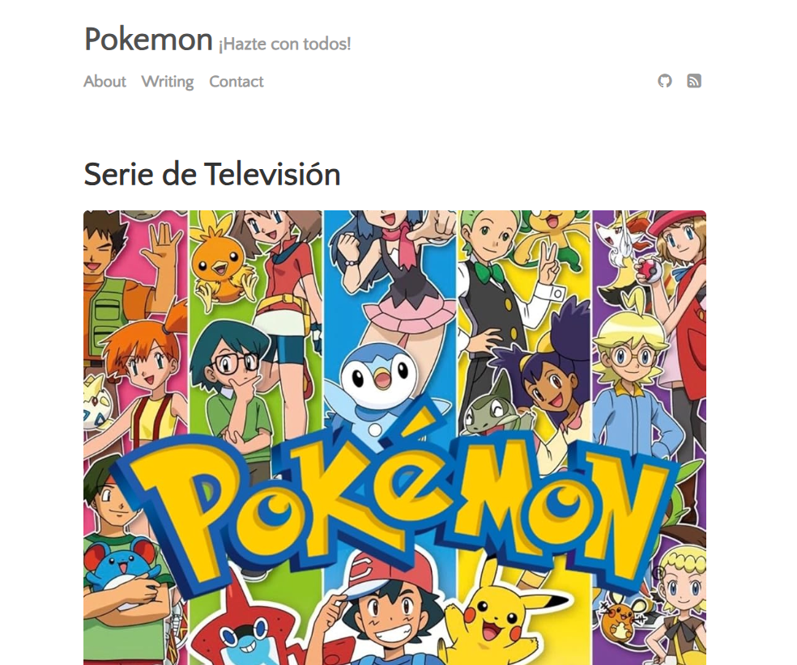  

