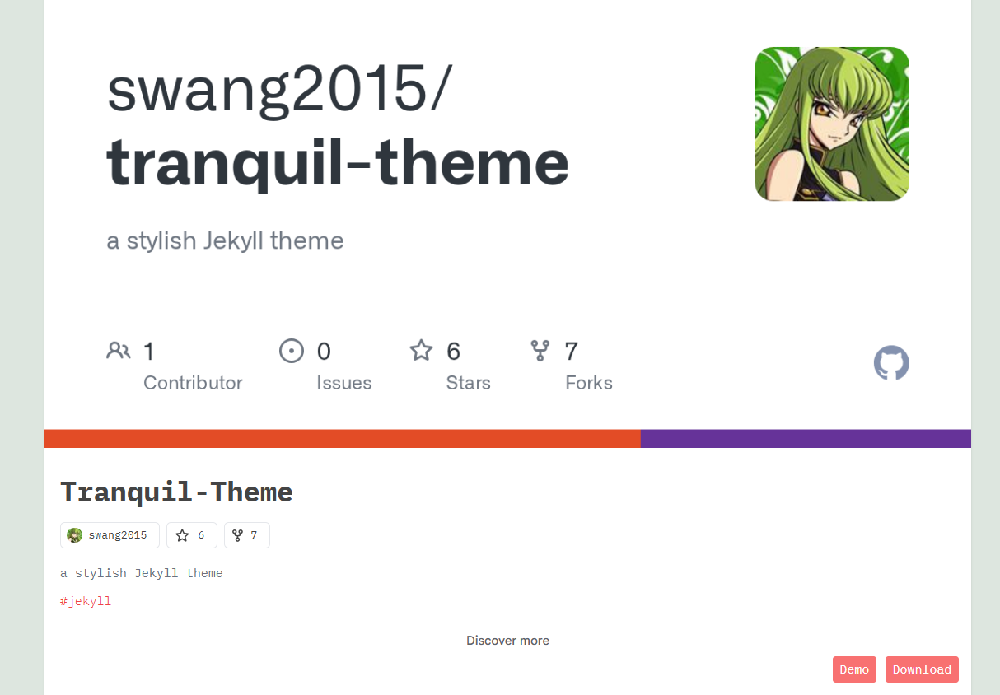

# Ejercicio 3
##  Prerrequisitos
Antes de realizar la tarea habrá preparar la máquina virtual de Debian 13 para lo cual habrá que usar un ```sudo apt update``` y un ```sudo apt upgrade``` para actualizar los repositorios y así poder posteriormente realizar un ```sudo apt-get install ruby-full build-essential zlib1g-dev``` para instalar las gemas.  

Además, habrá que realizar los siguientes comandos para agregar las variables de entorno a los archivos *~/.bashrc* para configurar la ruta de instalación de las gemas:
- ```echo '# Install Ruby Gems to ~/gems' >> ~/.bashrc```
- ```echo 'export GEM_HOME="$HOME/gems"' >> ~/.bashrc```
- ```echo 'export PATH="$HOME/gems/bin:$PATH"' >> ~/.bashrc```
- ```source ~/.bashrc```

Por ultimo habrá que usar el comando ```gem install bundler Jekyll``` para instalar bundler y jekyll.  
## Ejecución
### Paso 1: Crear el repositorio en GitHub
El primer paso será ir a la página web de *jekyll themes* y buscar el tema deseado que en este caso será **tranquil-theme**, después habrá que seleccionarle tras lo cual habrá que clicar en *download* para habrir el repositorio en GitHub del creador de **tranquil-theme**.     

    

A continuación habrá que hacer un fork al repositorio de **tranquil-theme** para lo cual habrá que seleccionar la opción *fork* que se encuentra en la zona superior derecha y darle a *New fork* tras lo cual saldrá una pestaña con una serie de campos los cuales son *Repository name* donde pondré el nombre que deseo ponerle al repositorio, *Description* donde pondré una breve descripción del repositorio y además seleccionaré la opción *Copy the gh-pages branch only* para que solo copie la información que se encuentra en la rama gh-pages. Por último, habrá que clicar en *Create frork* para terminar el fork.    

  

  

### Paso 2: Crear el repositorio local
El segundo paso será crear el repositorio local para lo cual en la carpeta repositorios habrá que usar el con el comando ```git clone https://AliciaSP2004:gh.......``` donde el enlace es el del repositorio de GitHub añadiéndole después de // el nombre del usuario : mi token @.    

  
### Paso 3: Modificar los archivos
Para que la página web cumpla con las especificaciones pedidos por la tarea y que tenga las características deseadas hay que modificar y crear una serie de archivos necesarios para el correcto funcionamiento y la estética deseada de la página web.   

     

Durante la modificación de los archivos he comprobado en varias ocasiones que todos esté creando correctamente para lo cual he utilizado el comando ```bundle exec jekyll build```.  

- #### _config.yml
El primer archivo que he modificado es el *_config.yml* donde he modificado *title* para ponerle a la página un título acorde al tema del que va a tratar que en este caso será Pokemon,*username* para poner mi usuario de GitHub, *email* para poner mi email, *description* para poner una breve descripción para la página, *url*para poner la url que tendrá la página web que en este caso sera **"https://info-pokemon-iaw.netlify.app"** y *aboutme* en el que he puesto una breve descripción del autor que en este caso soy yo.

 
- #### category.html
También he modificado el archivo *category.html* cambiando ```<span class="category-subtitle">Busca la categoría</span>``` para que en el buscador de categorías salga el texto en castellano.

 
- #### widget_about.html
Otro archivo que he modificado ha sido *widget_about.html* que se encuentra dentro de *_includes* para cambiar la línea `````` y asi modificar la parte sobre el creador de la página que en este caso soy yo.
Concreamente en ```'/images/about.jpg'``` he cambiado el nombre de la imagen para que coincida con el que yo quiero poner y en ```alt="Sobre mi"``` he puesto el título de sa sección en castellano.

 
- #### widget_blog.html
Además he modificado el archivo *widget_blog.html* que se encuentra dentro de *_includes* para quitar la parte del banner publicitario para lo cual he comentado esa sección.

 
- #### page.md
Otro archivo que ha modificado es el *page.md* al que le he cambiado el *title* para que corresponda con el tema de la página siendo este **¿Qué es un Pokémon?**, también le he puesto una breve descripción de lo que es un Pokémon y le he añadido una imagen con algunos Pokémon.  

 
- #### pokemon.md
He creado el markdown *pokemon.md* usando como plantilla el archivo *page.md* al que le he cambiado el *title* para que corresponda con el tema de la página siendo este **Empresa Pokemon**, también le he puesto una breve descripción de la empresa Pokemon y le he añadido una imagen.  

 
- #### serie.md
He creado el markdown *serie.md* usando como plantilla el archivo *page.md* al que le he cambiado el *title* para que corresponda con el tema de la página siendo este **Serie de Televisión**, también le he puesto una breve descripción de la Serie de Televisión Pokemon y le he añadido una imagen.  

 

- #### _posts
Para los post he ido a la carpeta *_posts* y he cogido el que había predeterminado como plantilla para realizar otros 3 posts. Los nombres que les he puesto los post para identificarlos más fácilmente siguen la siguiente estructura fecha_creacion-nombre_post.md.     

Las modificaciones qué he hecho en los archivos de los post han sido cambiarle el *title* para que corresponda con el pokemon del que va a hablar el post, cambiarle el *date* para que tengan la fecha actualizada de cuando se publicó el post, cambiarle el *background* para ponerle una imagen de portada mas acorde con el pokemon del que va ha hablar, cambiarle *category* por la categoria en la que se encuentra el pokemon, cambiarle *tags* por las etiquetas que clasifican al pokemon, añadirle una breve descripción del pokemon y añadirle una foto que muestre al Pokemon del que trata el post.

   

   

 

- #### social.yml
Otro documento que he modificado ha sido el social.yml que se encuentra dentro de _data para cambiar las redes sociales por defecto por mis redes sociales para lo cual he eliminado las redes sociales que no me interesa poner y he modificado el apartado de instagram para poner mi instagram y el de GitHub para poner en link a mi GitHub.


- #### Imágenes
Para añadir las imágenes a los archivos Markdown y que no haya errores he añadidos las imagenes a la carpeta *imges* que se encuentra dentro de la carpeta *_site*.


### Paso 4: Guardar y subir el trabajo
Para conseguir que las modificaciones que he hecho el local se guarden en GitHub he utilizado el comando ```git add .``` para preparar los cambios, el comando ```git commit -m “Cambios realizados”``` para guardar los cambios y el comando ```git push origin gh-pages``` para subir los cambios al repositorio de GitHub.  


### Paso 5: Publicar el sitio 
Para publicar el sitio hay que ir a la página de *Netlify* e iniciar sesión. Tras iniciar sesión habrá que ir a *Projects* y clicar en *Add new proyect*, *Import an existing project* para que cree la página usando un repositorio ya existente en otra plataforma. En la página que salga habrá que elegir de dónde quieres coger el proyecto del que sacará la información que en este caso es *GitHub* y elegir el repositorio que quieres convertir en página web que en este caso será el *ejercicio3*. 

  

  

  

Tras los pasos anteriores aparecerá una pestaña con una serie de campos a rellenar que en este caso será en review configuration for ejercicio3 en el apartado proyect name habría que poner el nombre del proyecto que en este caso será info-pokemon-iaw y en build settings en el apartado branch to the deploy habrá que elegir gh-pages, En base directory habrá que dejarlo vacío, en build command habrá que poner buildle exec jeckyll serve, en publish directory habrá que poner _site y en functions directory habrá que dejarlo vacío. Tras rellenar todos los apartados habrá que clicar en Deploy ejercicio3.  

  

  

Por último, habrá que esperar a que se cree la página web supervisando que se cree correctamente para lo cual habrá que ir a Deploys y supervisar cada paso de los Deploy log, observar que la información que presenta Deploy summary sea correcta asegurarte de que en Deploy file browser se ha creado la estructura deseada para el repositorio.  

    

   
      
    

Para ver cómo ha quedado la página web habrá que ir a la página de inicio de Netlify, seleccionar la página que hayas creado, ir a Deploy y allí clicar en el nombre de la pagina que en este caso será info-pokemon-iaw.netlify.app.  

   

 

